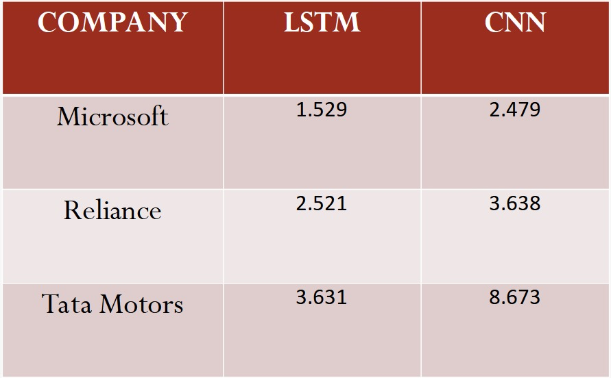

# STOCK-PRICE-PREDICTION-USING-LSTM-AND-CNN
       Tool to accurately predict the future closing value of a given stock across a given period
       of time in the future.The data used in this project is of 3 companies : Microsoft(January 2, 
       1990–November 18, 2021), Reliance (January 1,1996–November 18,2021),Tata Motors(Dec 25,1995–
       November 18,2021) saved in csv files; MICROSOFT.NS.csv, RELIANCE.NS.csv,TATAMOTORS.NS.csv.
       
## Model Building of LSTM/CNN

       1.Reading data using parse date
       2.Correlation Analysis
       3.Normalizing the data
       4.Train test Split using Timeseriessplit
       5.Benchmark Model
       6.Process the data for LSTM/CNN
       7.Model building : LSTM/CNN
       8.Evaluation of Model/CNN
       9.Predictions made by LSTM/CNN
       10.LSTM's Prediction Visual
       11.Converting Prediction data to a excel file
       
## Output

       The prediction results of Microsoft, Reliance, Tata Motors for LSTM and CNN is saved in
       excel files; PredictionResults_LSTM_FOR_MICROSOFT.xlsx,PredictionResults_LSTM_FOR_RELIANCE.xlsx,
       PredictionResults_LSTM_FOR_TATAMOTORS.xlsx, PredictionResults_CNN_FOR_MICROSOFT.xlsx,
       PredictionResults_CNN_FOR_MICROSOFT.xlsx, PredictionResults_CNN_FOR_MICROSOFT.xlsx.
       
        
       
